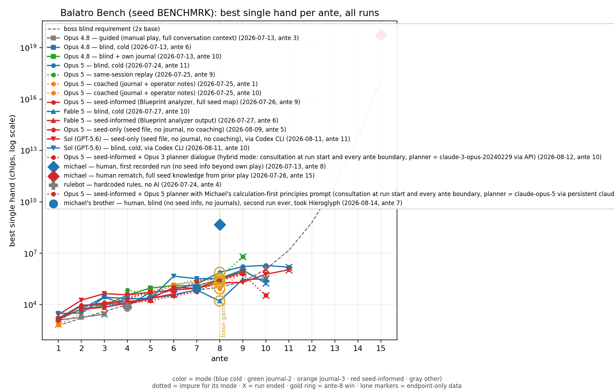

# Balatro Bench

A reproducible, sandboxed benchmark of how well AI agents play [Balatro](https://www.playbalatro.com/),
driving the **real game** through a local JSON-RPC API on a fixed seed. Entrants
so far: Claude models (Opus 4.8, Opus 5, Fable 5), OpenAI's GPT-5.6 "Sol" via
Codex CLI, a human, and a hardcoded rule bot.

**[Leaderboard](bench-results.md)** · **[Protocol and rigor notes](PROTOCOL.md)** ·
**[Per-ante graphs and data](analysis/)** · **[Run journals](runs/)**

## The task

One solo run of Balatro: seed `BENCHMRK`, Red Deck, White Stake, no lives.
Primary metric: furthest ante reached (read from the game, never self-reported).
Tiebreak: best single hand. Beating ante 8 counts as winning the base game;
runs continue into endless mode.

The agent gets a self-contained prompt (API reference + rules; see
`runs/*-prompt.txt` for the exact text given to each entrant), plays through
hundreds of JSON-RPC calls against a live game instance, and must keep a
journal with a best-hand line per ante. Journals feed the per-ante progression
graphs in `analysis/`.

## The four modes

1. **Cold** — no context beyond how to play and launch. Measures raw ability.
2. **Journal, attempt 2** — the only added context is the journal the same
   model wrote during its own attempt 1. Measures one step of self-improvement.
3. **Journal, attempt 3** — same rule, one more iteration.
4. **Seed-informed** — the model gets a seed-analyzer readout of BENCHMRK
   (bosses, vouchers, tags, shop queues). Measures execution with perfect
   information.

Historical runs that mixed in anything else (operator coaching, same-session
context) are on the leaderboard but flagged impure; the exact mapping and
purity flags are machine-readable in `analysis/per-ante-data.json`.

## Results so far (2026-08-11, 14 runs)



- **The human is far ahead.** With seed knowledge from his own prior play,
  the operator reached ante 15 with a 5.32e19 best hand. The best AI runs
  reach ante 11 with best hands around 1-2 million: **Opus 5 cold**
  (1,947,113) and **Sol / GPT-5.6 seed-informed** (1,074,154).
- **Ante 11 is the current AI wall.** Three separate runs died at The Mouth /
  The Manacle (14.4M requirement) within a factor of ten of each other, while
  the human cleared that ante with nine orders of magnitude to spare. The gap
  is compounding multiplicative engines (glass/retrigger stacking), which no
  AI run has assembled in time.
- **Self-improvement from a journal works.** Opus 4.8 went from ante 6 (cold)
  to ante 10 given nothing but the journal its own first run wrote.
- **Seed intelligence is not free ability.** The same seed file that took
  Sol to ante 11 made every Claude run *worse* than its cold baseline
  (antes 5-9 vs 10-11): models over-committed to the map — rerolling money
  away toward shop entries that shift once you own jokers, and pre-routing
  builds — instead of playing the cards in front of them. The human, by
  contrast, converted seed knowledge into +7 antes.
- **Non-LLM floor:** a hardcoded rule bot (`rulebot/`) reaches ante 4 in 171
  seconds.

Full rows with dates, caveats, and artifacts: [bench-results.md](bench-results.md).
Per-model attempt curves and the mode matrix: [analysis/](analysis/).

## Integrity measures

- **Server-side sandbox**: the game mod hard-rejects the state-editing
  endpoints (`set`/`add`/`load`) when launched in bench mode; verified before
  every run. Agents can only advance the run through legitimate play.
- **Vanilla card pool**: the launcher regenerates the mod blacklist each run
  (everything except the API mod and its loaders) and purity is verified from
  the loader log. A run that saw modded content is voided (this has happened,
  and is documented).
- **Context isolation**: every run launches from a fresh, never-used working
  directory so agent-side memory systems have nothing to recall. One cold run
  was voided when this failed (documented in PROTOCOL.md), which is why it is
  now standard. Claude entrants additionally run under permission deny-rules
  that technically block reading other entrants' journals and web access.
- **Post-run audits**: transcripts are audited for forbidden file reads,
  memory recalls, and cheat-endpoint calls before results are certified.
- **Authoritative scoring**: final ante and best hand come from the game state
  and a game-over screenshot, not from the agent.

## Known caveats (see PROTOCOL.md for the full list)

- The API reveals some information the human client hides (face-down cards,
  Amber Acorn's flipped jokers) and hides some it shows (Cerulean Bell's
  forced card). Affected clears are annotated on the leaderboard.
- Harness bugs fixed mid-history are listed with dates in PROTOCOL.md; runs
  before a fix played under the stricter/buggier behavior.
- One fixed seed is one deal. It is memorizable once public; the rigor
  upgrade is seed rotation, which this bench trades away for reproducibility.
- A model's innate Balatro knowledge is part of what is measured.

## Reproduction

You need Balatro (Steam) and git; `setup.ps1` handles everything else — it
installs the [lovely injector](https://github.com/ethangreen-dev/lovely-injector),
[Steamodded](https://github.com/Steamodded/smods), and the
[balatrobot fork](https://github.com/Michael-Andrzejewski/balatrobot) (`fable`
branch) that adds the bench sandbox, the reliability fixes, and the win-screen
operator checkpoint:

```powershell
powershell -ExecutionPolicy Bypass -File setup.ps1
```

- `bench-launch-ai.ps1 -Port 12347` — launch a sandboxed instance (regenerates
  the blacklist, sets `BALATROBOT_BENCH=1`).
- `bench-rpc.ps1` — the PowerShell JSON-RPC helper the agents call.
- `bench-restore.ps1` — restore the normal mod set afterward.
- `arena/<entrant>/` — one directory per run: the exact prompt, any permitted
  seed file, sandbox settings, and the journal the agent wrote.

Scripts are Windows PowerShell and contain machine-specific absolute paths;
adapt paths for your setup. The seed analysis file given to mode-4 entrants
was generated with the community Blueprint seed analyzer.

## Provenance

Built by Michael Andrzejewski (Soareverix) with Claude (Anthropic) doing the
harness engineering; the AI entrants played unassisted under the conditions
listed per row. Results involving a model are shared with that model's consent
(see PROTOCOL.md, "Procedure").
